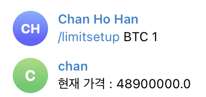
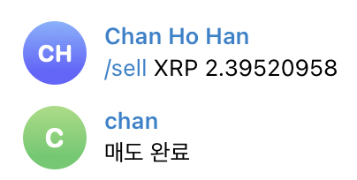

# Coding Trading Bot

[프로젝트 설명 링크](https://www.notion.so/632308649c88426f86483baa76538e3a)
---

## Summary
코인 트레이딩 봇
## Description
 
코인에 항상 집중할 수 없는 상황에 있는 사람들을 위해 코인의 하한가를 지정해 놓음으로써 텔레그램으로 알림이 울리고 팝업이 뜹니다.  
 
팝업창을 누름과 동시에 원하는 코인의 이름과 가격을 누름으로써 손 쉽게 코인을 매수할 수 있도록 도와주는 프로그램입니다. 

(주의 : 투자에 대한 책임은 프로그램 개발자가 아닌 투자자 본인에게 있습니다.)

## Setting

- 파이썬 프로그램이 실행되고 있어야 합니다.

1. terminal 또는 cmd를 실행시킨다.

2. "git clone" 으로 본 프로젝트를 클론한다.

3. "python3 -m pip install -r requirements.txt" 으로 필요한 라이브러리를 설치한다. 파이썬3이 설치되어 있지 않다면 [여기](https://wikidocs.net/8)를 눌러주세요.

4. [telegram_token.txt](https://www.notion.so/telegram-bot-setting-b1733a3ee8a645338803727436b4faa4), [access_key.txt, secret_key.txt](https://www.notion.so/access-key-secret-key-e62a10d1ba05490b90b3a2f2eb7a4973)가 필요합니다. 링크를 통해 토큰 및 키를 발급 받은 후 프로젝트 폴더(coin-trading-bot 폴더 안)에서 각각의 txt파일에 각각 키 정보를 넣어 생성해 줍니다.

5. "python3 telegram_bot.py"를 통해 파일을 실행시킨다.

## How To Use
 
1. 하한가 지정 및 코인 알림

- 사용 예시

명령어 : /limitsetup [코인 심볼] [하한가(%)]

`원하는 코인이 지정한 하한가에 도달했을 경우 위 사진 처럼 알람이 울립니다.`

단, 일회성 코드입니다.

  

2. 원하는 코인을 원하는 가격 만큼 시장 가격으로 매수

- 사용 예시

명령어 : /buy [코인 심볼] [원하는 총 가격]

`원하는 코인을 원하는 총 가격 만큼 시장 가격으로 매수합니다.`
  
  

3. 원하는 코인을 원하는 수량 만큼 시장 가격으로 매도

- 사용 예시

명령어 : /sell [코인 심볼] [원하는 코인의 총 수량]

`원하는 코인을 원하는 총 수량만큼 시장 가격으로 매도합니다.`
